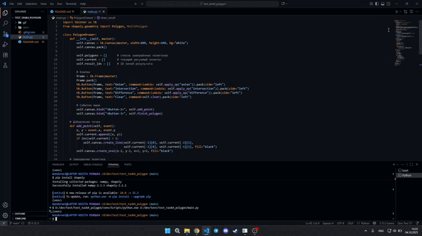

# Операции с полигонами

## Описание проекта
Программа позволяет создавать полигоны с помощью мыши и выполнять стандартные теоретико-множественные операции над ними: объединение (Union), пересечение (Intersection) и разность (Difference).  

Особенности:
- Рисование нескольких полигонов на холсте.
- Поддержка операций над множеством полигонов.
- Очистка холста для нового ввода.

## Технологии:
- **Backend / логика:** Python
- **GUI:** Tkinter
- **Математика:** Shapely (булевы операции с полигонами)

## GIF-демонстрация

## Установка и запуск

## 1. Клонируйте репозиторий:

git clone https://github.com/Wonderwol/test_task4_polygon.git
cd test_task4_polygon

## 2. Создайте и активируйте виртуальное окружение:

python -m venv venv

Windows
venv\Scripts\activate

macOS/Linux
source venv/bin/activate

## 3. Установите зависимости:
pip install -r requirements.txt

## 4. Запуск программы:
python main.py

Программа откроет окно с холстом, на котором можно рисовать полигоны с помощью мыши:

Левой кнопкой мыши добавляются точки.

Правой кнопкой мыши завершается полигон.

Кнопки Union, Intersection, Difference выполняют соответствующие операции над нарисованными полигонами.

Кнопка Clear очищает холст.